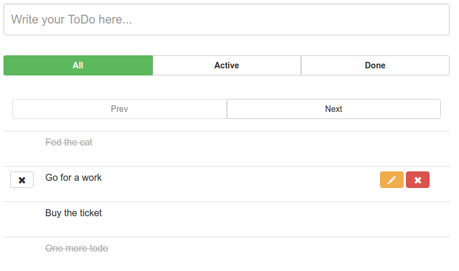

## The second test task for JavaRush internship ##

### How to ###

 1. Create table User with sql `/src/main/webapp/resources/SQL/createTableTodo.sql`

 2. Populate table with sql `/src/main/webapp/resources/SQL/populateTableTodo.sql`

 3. Compile project with `mvn install`

 4. Put compilied `target/AstotalTODO.war` into Tomcat7 webapps folder and run Tomcat

 5. Application can be accessed by address [http://localhost:8080/AstotalTODO/todo]()
 
 